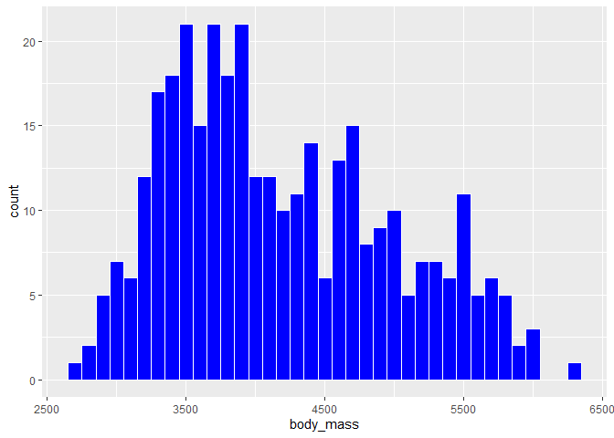
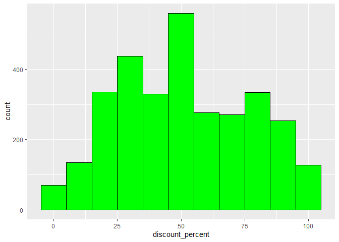

Assignment1
================
Wenbo
2025-11-02

# Setup

Begin by loading your data and the tidyverse package below:

``` r
library(datateachr)
library(tidyverse)
```

    ## ── Attaching core tidyverse packages ──────────────────────── tidyverse 2.0.0 ──
    ## ✔ dplyr     1.1.4     ✔ readr     2.1.5
    ## ✔ forcats   1.0.0     ✔ stringr   1.5.2
    ## ✔ ggplot2   4.0.0     ✔ tibble    3.3.0
    ## ✔ lubridate 1.9.4     ✔ tidyr     1.3.1
    ## ✔ purrr     1.1.0     
    ## ── Conflicts ────────────────────────────────────────── tidyverse_conflicts() ──
    ## ✖ dplyr::filter() masks stats::filter()
    ## ✖ dplyr::lag()    masks stats::lag()
    ## ℹ Use the conflicted package (<http://conflicted.r-lib.org/>) to force all conflicts to become errors

``` r
#class("blue")
library(roxygen2)
library(testthat)
```

    ## 
    ## Attaching package: 'testthat'
    ## 
    ## The following object is masked from 'package:dplyr':
    ## 
    ##     matches
    ## 
    ## The following object is masked from 'package:purrr':
    ## 
    ##     is_null
    ## 
    ## The following objects are masked from 'package:readr':
    ## 
    ##     edition_get, local_edition
    ## 
    ## The following object is masked from 'package:tidyr':
    ## 
    ##     matches

# Exercise 1: Make a Function and

# Exercise 2: Document your Function

Since I repeatedly create histograms with different sized bins in the
1.2 part of the 2nd mini data analysis, I think making it a function
would be a good choice.

``` r
#' Plotting histograms with different sized bins
#' 
#' Simply input the name of the data and the column to be plotted, and the function will plot the distribution of that column's variable. The function also supports setting the fill color and outline color of the output histogram.
#' 
#' @param plotting_item The data to be plotted/ Reason： I named it this way to clearly indicate that this variable represents the data item that need to be plotted.
#' @param plotting_col The column names in the data that need to be plotted/ Reason: "col" indicates column
#' @param BinSize An integer representing the bin size of the output histogram/ Reason: combination of the 2 words "Bin" and "Size"
#' @param outline_color a character representing the color of the histogram outline/ Note: Need quotation marks when using/ Reason: Simply combination of the 2 words "outline" and "color"
#' @param fill_color a character representing the color of the histogram filling/ Note: Need quotation marks when using/ Reason: Simply combination of the 2 words "fill" and "color"
#' @returns the output histogram(a ggplot object)

histogram_plotting <- function(plotting_item, plotting_col, BinSize, outline_color, fill_color){
  if(!is.numeric(BinSize)){
    #making sure the bin size is numeric
    stop("The BinSize must be numeric")
  }
  plotting_item %>%
    #filter the NA rows
    filter(!is.na({{plotting_col}})) %>%
    ggplot(aes(x = {{plotting_col}})) +
    #set the bin width and outline color and fill color
    geom_histogram(binwidth = BinSize, color = outline_color,fill = fill_color)
}
```

# Exercise 3: include examples

The function can directly use columns that already exist in the existing
dataset. For example in the “penguins” dataset,I will use the function
to show the distribution of penguin weights(each bar in the histogram
represents 100g,and I also set the outline color to white and the fill
color of bin to blue)

``` r
histogram_plotting(penguins,body_mass,100,"white","blue")
```

<!-- -->

The functions can also use newly created columns from an existing
dataset. For example in the “steam_games” dataset,I will show the
distribution of my newly created variable “discount_percent”(each bin in
the histogram represents 10 percent,and I also set the outline color to
black and the fill to green)

``` r
new_set_discount <- steam_games %>%
  #There are many missing or invalid values in the price columns, so we need to filter the valid data first.
  #There are also some wrong cases where discount price may bigger than the original price, so we need to filter them too.
  filter(!is.na(original_price), !is.na(discount_price), discount_price < original_price) %>%
  #Then Calculate the discount rate
  mutate(discount_percent = (original_price - discount_price) / original_price * 100)

histogram_plotting(new_set_discount,discount_percent,10,"black","green")
```

<!-- -->

# Exercise 4: Test the Function

``` r
test_plot <- histogram_plotting(penguins,body_mass,100,"white","blue")

#test the x label is "body_mass"
test_that("X mapping label is correct", {
  expect_equal(rlang::as_name(test_plot$mapping$x), "body_mass")
 })
```

    ## Test passed 🥇

``` r
#test the output is a "ggplot" object
test_that("plot object is correct", {
  expect_s3_class(test_plot, "ggplot")
 })
```

    ## Test passed 🌈

``` r
#test that the non-numeric bin size will give an error
test_that("non_numeric bin size should give an error", {
  expect_error(histogram_plotting(penguins,body_mass,error,"white","blue"))
 })
```

    ## Test passed 🎉
